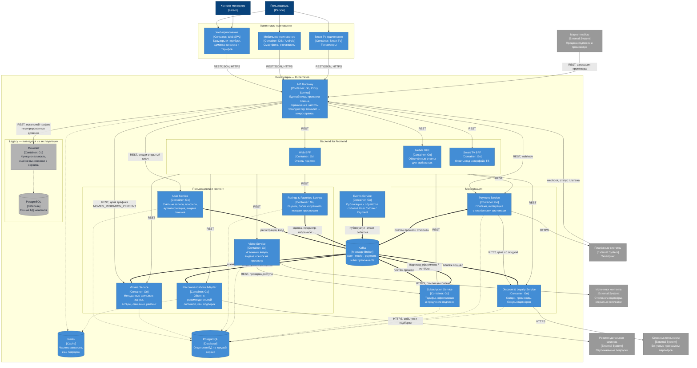

**Легенда связей:** сплошная стрелка — синхронный вызов REST, жирная — асинхронное сообщение через Kafka, пунктир — обращение к хранилищу.

## Домены

| Домен | Сервисы | Что входит |
|---|---|---|
| Пользователи | User Service | учётные записи, профили, аутентификация |
| Каталог | Movies Service | метаданные фильмов: жанры, актёры, описания, агрегированный рейтинг |
| Активность пользователя | Ratings & Favorites Service | оценки, избранное, история просмотров |
| Контент | Video Service | источники видео, выдача ссылок на просмотр |
| Рекомендации | Recommendations Adapter | обмен данными со сторонней рекомендательной системой |
| Подписки и платежи | Subscription Service, Payment Service | тарифы, подписки, платежи |
| Скидки и лояльность | Discount & Loyalty Service | скидки, промокоды, партнёрские программы, маркетплейсы |
| Интеграция | API Gateway, BFF, Events Service, Kafka | единая точка входа, адаптация под клиента, доменные события |

## Владение хранилищами

| Сервис | Назначение | Хранилище |
|---|---|---|
| API Gateway | единая точка входа, проверка токена, ограничение частоты, маршрутизация Strangler Fig | Redis — счётчики частоты запросов |
| Web / Mobile / Smart TV BFF | сборка ответа под конкретный клиент | нет, только вызовы сервисов |
| User Service | учётные записи, профили, выдача токенов | PostgreSQL |
| Movies Service | метаданные фильмов, агрегированный рейтинг | PostgreSQL |
| Ratings & Favorites Service | оценки, папки избранного, история просмотров | PostgreSQL |
| Video Service | источники видео, права на просмотр | PostgreSQL |
| Recommendations Adapter | подборки от рекомендательной системы | Redis — кэш подборок |
| Subscription Service | тарифы, подписки, сроки действия | PostgreSQL |
| Payment Service | платежи и их статусы | PostgreSQL |
| Discount & Loyalty Service | скидки, промокоды, бонусы | PostgreSQL |
| Events Service | MVP событийного обмена: публикует и обрабатывает события | Kafka |
| Монолит | ещё не вынесенная функциональность | PostgreSQL — общая БД монолита |

Общей базы у новых сервисов нет

## Ключевые взаимодействия

**Весь внешний трафик идёт через API Gateway.** Клиенты, маркетплейсы и платёжные системы с их уведомлениями обращаются к одному адресу. Шлюз проверяет токен, ограничивает частоту запросов и решает, куда отправить запрос. Внутренние сервисы наружу не публикуются.

**Переход с монолита — через Strangler Fig.** Шлюз знает, какие домены уже вынесены. Для домена в процессе переезда включается фиче-флаг `MIGRATION`, и в новый сервис уходит доля трафика `MIGRATION_PERCENT`, остальное — в монолит. Долю поднимают постепенно до 100 %, после чего код и таблицы домена из монолита удаляют. Первым выносится Movies Service. Клиенты адреса не меняют, поэтому переход проходит без простоя и незаметно для пользователей.

**Под каждый тип устройства — свой BFF.** Мобильным, ноутбукам и Smart TV нужны разные интерфейсы и разный объём данных. BFF собирает ответ из нескольких доменных сервисов и отдаёт ровно то, что нужно экрану: мобильному — облегчённую карточку фильма, телевизору — крупные подборки. Бизнес-логики в BFF нет, только агрегация и форма ответа, поэтому изменение под один клиент не задевает остальные.

**Синхронно — только то, где нужен ответ сразу.** Проверка доступа к видео по подписке и расчёт цены со скидкой при оплате делаются вызовом REST: без результата пользователь не может продолжить. Остальное межсервисное взаимодействие идёт через события.

**Последствия действий пользователя обрабатываются событиями.** Payment Service публикует факт платежа, по нему Subscription Service продлевает подписку, а Discount & Loyalty начисляет бонусы. Ratings & Favorites публикует оценку, Movies Service пересчитывает агрегированный рейтинг. Сервис-источник не знает о потребителях, и новый потребитель подключается без изменения источника.

**Рекомендации отделены адаптером.** Рекомендательная система сторонняя и уже работает асинхронно. Recommendations Adapter читает события о входе, просмотре и оценке, передаёт их во внешнюю систему, а подборки кэширует в Redis. Недоступность внешней системы не ломает процесс - BFF получает последнюю сохранённую подборку.

**Каждая внешняя интеграция принадлежит одному домену.** Платёжные системы — Payment Service, программы лояльности — Discount & Loyalty, источники контента — Video Service, рекомендательная система — Recommendations Adapter. Смена провайдера затрагивает один сервис. Уведомления платёжных систем и запросы маркетплейсов приходят через шлюз, как и остальной внешний трафик.

**Events Service — MVP событийного обмена.** Он проверяет, как Kafka встраивается в архитектуру: по вызову API публикует события User, Movie и Payment в топики `user-events`, `movie-events`, `payment-events` и сам же их читает, записывая обработку в лог. После проверки гипотезы публикация переходит в доменные сервисы, как показано на диаграмме.

**Токены выдаёт User Service, проверяет шлюз.** Подпись асимметричная: шлюз получает открытый ключ у User Service и кэширует его, поэтому на каждый запрос в User Service ходить не нужно. Сервисы получают от шлюза уже проверенный контекст пользователя.

**Всё разворачивается в Kubernetes.** Каждый сервис — отдельный Deployment со своим числом реплик. Установка идёт Helm-чартом, сборка образов и тесты — через CI/CD в GitHub Actions. Istio добавляет Circuit Breaker между сервисами и канареечные выкладки.
