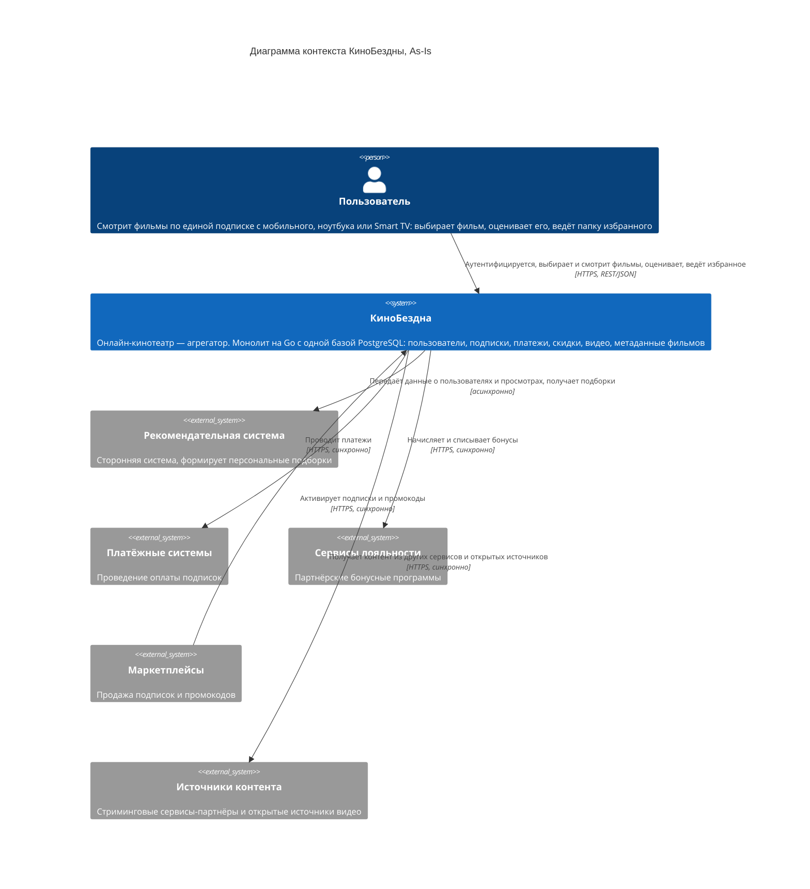

```mermaid
C4Context
    title Диаграмма контекста КиноБездны, As-Is

    Person(user, "Пользователь", "Смотрит фильмы по единой подписке с мобильного, ноутбука или Smart TV: выбирает фильм, оценивает его, ведёт папку избранного")

    System(cinema, "КиноБездна", "Онлайн-кинотеатр — агрегатор. Монолит на Go с одной базой PostgreSQL: пользователи, подписки, платежи, скидки, видео, метаданные фильмов")

    System_Ext(recsys, "Рекомендательная система", "Сторонняя система, формирует персональные подборки")
    System_Ext(payment, "Платёжные системы", "Проведение оплаты подписок")
    System_Ext(loyalty, "Сервисы лояльности", "Партнёрские бонусные программы")
    System_Ext(market, "Маркетплейсы", "Продажа подписок и промокодов")
    System_Ext(source, "Источники контента", "Стриминговые сервисы-партнёры и открытые источники видео")

    Rel(user, cinema, "Аутентифицируется, выбирает и смотрит фильмы, оценивает, ведёт избранное", "HTTPS, REST/JSON")
    Rel(cinema, recsys, "Передаёт данные о пользователях и просмотрах, получает подборки", "асинхронно")
    Rel(cinema, payment, "Проводит платежи", "HTTPS, синхронно")
    Rel(cinema, loyalty, "Начисляет и списывает бонусы", "HTTPS, синхронно")
    Rel(market, cinema, "Активирует подписки и промокоды", "HTTPS, синхронно")
    Rel(cinema, source, "Получает контент из других сервисов и открытых источников", "HTTPS, синхронно")
```
